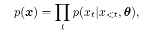
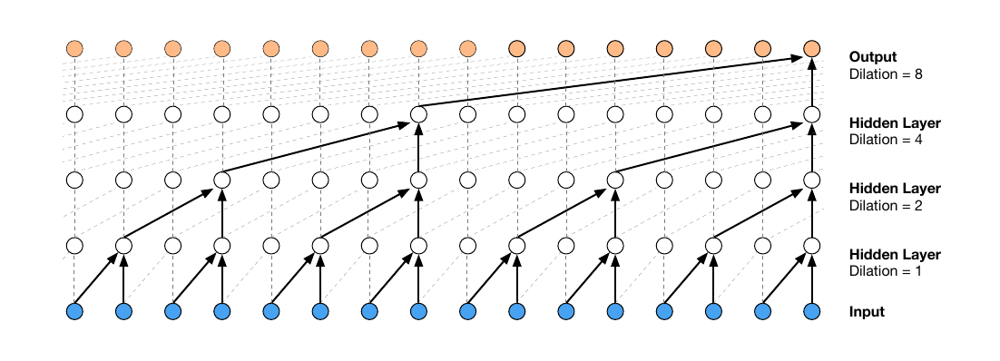
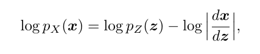
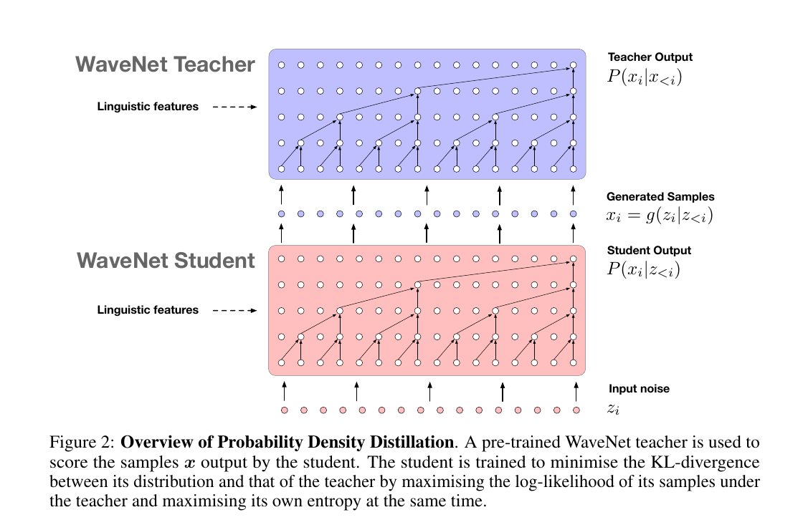
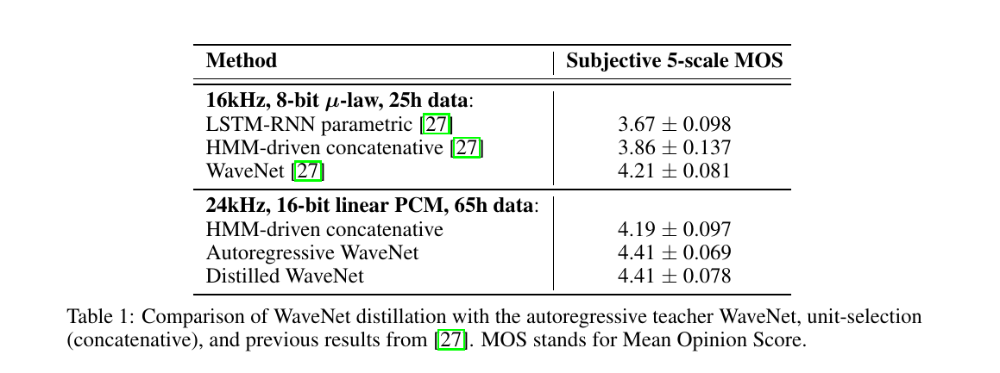
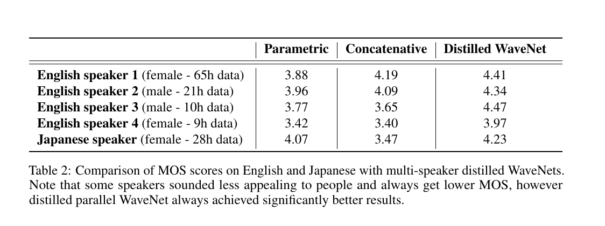
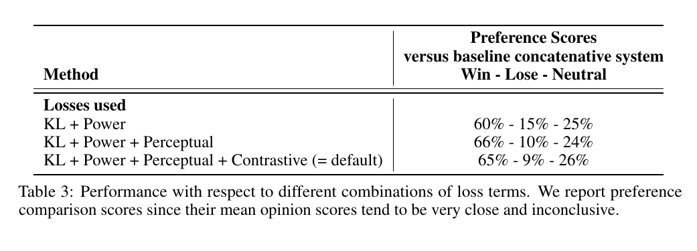

# Parallel WaveNet

[link](https://arxiv.org/pdf/1711.10433.pdf)

## Pre-requisites

[WaveNet](https://arxiv.org/pdf/1609.03499.pdf)

## Key Ideas

Introduced Probability Density

## Main Body

### Why Parallelize?

The sequential generation of audio samples due to the autoregressive nature of WaveNet is too slow for production environments. To solve this, a method called **probability density distillation** was used to generate long sequences of samples all at once and with **no loss of quality** over the original WaveNet. A fully-trained WaveNet model to **teach a second, “student” network** that is smaller dilated convolutional neural network, similar to the original WaveNet. Generation of each sample in the student network **does not** depend on any of the previously generated samples, meaning we can generate the first and last word - and everything in between parallelly making this method a lot more efficient. 

### WaveNet: Some brief info + changes

Autoregressive networks are modelled by this by probability distribution -

Due to the convolutional structure of WaveNet, it can be parallelized during training time (as all future audio samples are available), but during inference the audio samples need to be generated sequentially (xt before x(t-1)).

To model high dimensional data such as audio one would require a network with a broader receptive field (filter size for convolutional networks) resulting in a very deep network capture such dependencies. WaveNet tackled this by using **dilations** (skipped weights in between by filling zeros in the filter). The authors did try to reduce the size of the WaveNet network to deploy it in real-time but that resulted in degraded quality.

In this paper, the authors increased the fidelity of WaveNet by making some changes. They used 16-bit audio instead of 8 bit audio. Instead of using mu-law they used discretized mixture of logistics distribution, as modelling 65,536-way categorical distribution would be very costly. They increased the sampling rate from 16kHz to 24kHz and the dilation factor from 2 to 3 to cope with the increased dimension in audio data.

### Inverse-Autoregressive Flows (IAF)

A different architecture to support rapid, parallel generation of audio samples was needed. A Normalizing Flow is a **transformation** of a simple probability distribution (e.g., a standard normal) into a more complex distribution by a sequence of **invertible and differentiable** mappings. The name *normalizing flow* can be interpreted as the following:

1. **Normalizing** means that the change of variables gives a normalized density after applying an invertible transformation.
2. **Flow** means that the invertible transformations can be composed with each other to create more complex invertible transformations.

Normalizing flows provide a general way of constructing **flexible** probability distributions over continuous random variables.

***Change of variables formula:***

z ~ p(z)   (Simple distribution)

x ~ p(x)   (Complex distribution)

x = ft(z) = ft * ft-1 . . . * f0(z)
$$
p_\theta(x) = p_\theta(z) |det(\frac{\partial z}{\partial x}) |
$$
The magnitude of the Jacobian determinant which indicates **how much a transformation expands or contracts space** makes sure that the integration of the resulting probability density (p(x)) is always equal to 1. 

Inverse autoregressive flow (IAF), is a type of normalizing flow that scales well to high-dimensional latent spaces. The proposed flow consists of a chain of invertible transformations, where each transformation is **based on an autoregressive neural network**. 

The transformation f is typically chosen so that it is invertible and its Jacobian determinant is easy to compute.

Normalising flows might require repeated iterations to transform uncorrelated noise into structured samples.

### Probability Density Distillation

Here, we use an already trained autoregressive WaveNet model i.e. teacher (pt(x)) and a parallel WaveNet i.e. student (ps(x)) which learns from the teacher. White noise is fed to the

This architecture looks similar to that of GANs except here the teacher isn't conflicting with the student but guides the student to match the teacher's probabilities.

Kullback–Leibler divergence (DKL) measures how much one distribution differs from the other. It is also referred to as relative entropy. 

### Additional Loss Terms

The KL loss alone does not constrain the distillation process enough to obtain natural sounding speech (e.g., low-volume audio suffices for the KL) so extra loss functions were used.

1. Power Loss - This makes sure that the output generated speech matches the energy of human speech to avoid cases like whispering.
2. Perception Loss - This loss helps in penalizing bad pronunciations.  Two methods were tested to produce perceptual loss - the feature reconstruction loss (the Euclidean distance between feature maps in the classifier) and the style loss (the Euclidean distance between the Gram matrices). The latter performed better.
3. Contrastive Loss - This loss was used to reduce noise in generated speech.

## Results

In all the experiments, models were conditioned on linguistic features (as in original WaveNet) and pitch information (log of fundamental frequency).  The sampling speed of the autoregressive model is 172 timesteps/second for whereas it is 500,000 timesteps/second for the distilled model showing a speed up of over 3 orders of magnitude.

Regarding audio fidelity, the MOS scores of autoregressive and distilled WaveNet were pretty much the same.

For multi-speaker generation, distilled WaveNet outperformed both baselines (parametric and concatenative).

To evaluate the improvement of the model over introducing the extra loss functions, the authors used A/B testing as the MOS scores of these models were very similar. We can observe that adding the contrastive loss did not improve the preference scores but makes the generated speech less noisy. Most raters do not pay attention to this. 

## References

[DeepMind](https://deepmind.com/blog/article/wavenet-launches-google-assistant)

[Normalizing Flows IEEE](https://arxiv.org/pdf/1908.09257.pdf)

